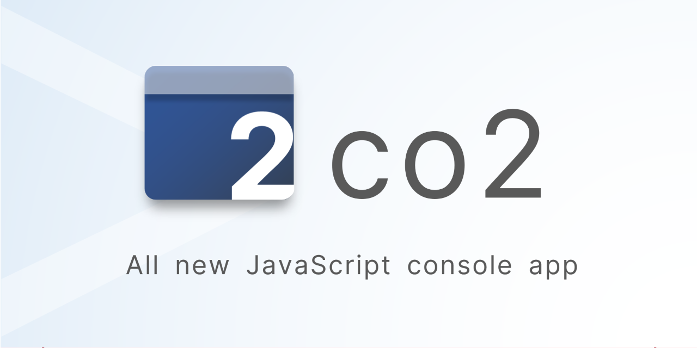

# co2



PWA JavaScript Console

## Setup

Make sure to install the dependencies:

```bash
bun install
```

## Development Server

Start the development server on `http://localhost:3000`:

```bash
bun run dev
```

## Production

Build the application for production:

```bash
bun run generate
```
